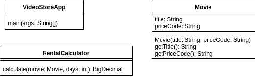
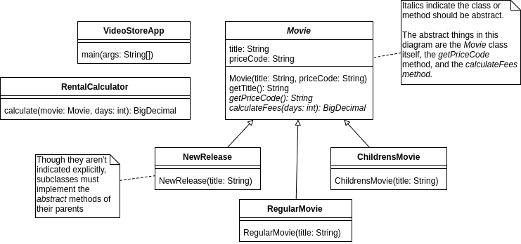
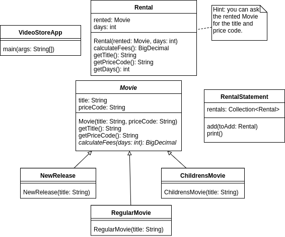

# Video Store

This exercise is adapted from a classic example, the "Replace Conditional with Polymorphism" refactoring found in Fowler's *Refactoring* book.

## Setup

- Fork the existing repository (based on in-class work).
    - [ ] Navigate to https://github.com/WeCanCodeIT/java-video-store in your browser.
    - [ ] Create a fork of this repository to your account via the "Fork" button at the upper right.
- Set up your workspace.
    - [ ] Open Git Bash.
    - [ ] Use `git clone <your-repository-url>` to clone your fork of the repository (**not** the original repository -- the url you use should contain your GitHub username).
    - [ ] Change to the directory of the cloned repository (`cd java-video-store`).
    - [ ] Run `gradle eclipse` to set up your Eclipse project.
    - [ ] Open Eclipse.
    - [ ] Import the project by selecting *File->Import…* then choosing *General/Existing Projects into Workspace*, navigating to and selecting the java-video-store directory.

        Enjoy a trouble-free push of your exercise for submission!

## Current state

Here is a representation of the classes in our current code:

## Phase 1

We already have rental prices being calculated. What we'll do first is to leverage polymorphism, using it instead of a conditional, to simplify calculating rental prices. Here's what our classes should look like after this phase is complete:

### Required Changes

Rather than calculating the fees inside the `calculate` method of `RentalCalculator`, we'll be calculating fees inside the new `calculateFees` method of each `Movie` subclass. To do so, it will be necessary to create (construct) specific types of movies.

**Please complete Phase 1 before moving on to Phase 2.**

## Phase 2

We would like to print out a statement for rentals. To this end, we'll be changing our model to incorporate a `Rental` and `RentalStatement`. You will need to use an appropriate type of `Collection` to store `Rental` instances inside `RentalStatement`. In `VideoStoreApp`'s main method, we will:

- [ ] Create a `RentalStatement` object.
- For each rental, we will:
    - [ ] create a `Rental` object
    - [ ] add this rental to the `RentalStatement` via its `add` method
- [ ] Call `RentalStatement`'s `print` method, which should print the following for each rental:
    - priceCode
    - title
    - fees

Here is how our classes should look after this is complete:

## Extensions

- How can you refactor the `Movie` hierarchy to eliminate duplication in the calculation of fees?
- Read the rented movies from a file which contains the priceCode, title, and days. Research the pattern you might use to instantiate the appropriate type of movie based on its priceCode.

## Submission Link

*Coming soon!*